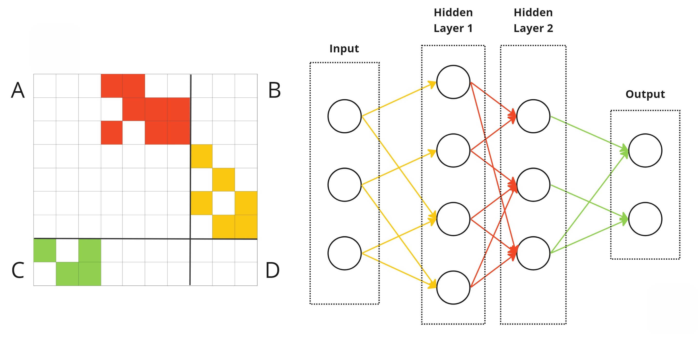
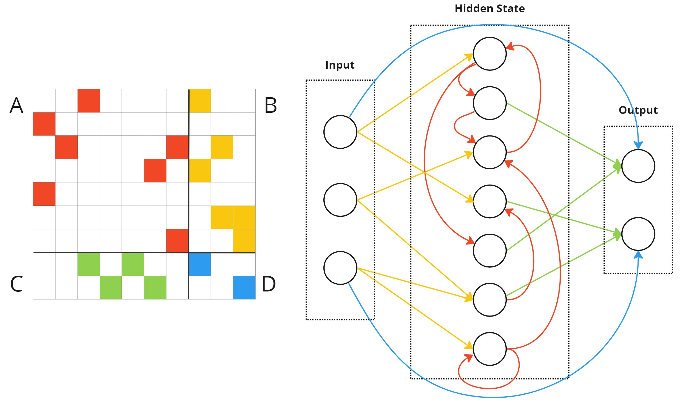

<div align="center">
  <h1>Implicit Deep Learning Package</h1>
</div>

<p align="center">
  <a href="LICENSE">
    
  </a>
</p>

<p align="center">
  <a href="https://github.com/HoangP8/Implicit-Deep-Learning/blob/main/tutorial.ipynb"><b>Quick Tutorial</b></a> 
  •
  <a href="https://github.com/HoangP8/Implicit-Deep-Learning?tab=readme-ov-file#installation"><b>Installation</b></a> 
  •
  <a href="https://idl.readthedocs.io/"><b>Documentation</b></a>
  •
  <a href="https://github.com/HoangP8/Implicit-Deep-Learning/tree/main/examples"><b>Examples</b></a>
  • 
  <a href="https://github.com/HoangP8/Implicit-Deep-Learning?tab=readme-ov-file#contribution"><b>Citation</b></a>
</p>

**Authors**: Hoang Phan, Bao Tran, Chi Nguyen, Bao Truong, Thanh Tran, [Khai Nguyen](https://xkhainguyen.github.io/), [Alicia Y. Tsai](https://www.aliciatsai.com/), [Hong Chu](https://sites.google.com/view/hongtmchu), and [Laurent El Ghaoui](https://people.eecs.berkeley.edu/~elghaoui/)

## Related Works 

**Implicit Deep Learning** \
[paper on arxiv](https://arxiv.org/abs/1908.06315) \
Laurent El Ghaoui, Fangda Gu, Bertrand Travacca, Armin Askari, Alicia Y. Tsai

**State-driven Implicit Modeling for Sparsity and Robustness in Neural Networks** \
[paper on arxiv](https://arxiv.org/abs/2209.09389) \
Alicia Y. Tsai, Juliette Decugis, Laurent El Ghaoui, Alper Atamtürk

## Introduction
Implicit Deep Learning finds a hidden state $X$ by solving a fixed-point equation instead of explicitly stacking layers conventionally. Given a dataset with input matrix $U \in \mathbb{R}^{p\times m}$ and output matrix $Y \in \mathbb{R}^{q\times m}$, where each column represents an input or output vector and $m$ is the batch size, the implicit model uses the following equations:

1. State equation:

$$X = \phi (AX + BU),$$

2. Prediction equation:

$$\hat{Y}(U) = CX + DU,$$

where $\phi: \mathbb{R}^{n\times m} \to \mathbb{R}^{n\times m}$ is a nonlinear activation that is strictly increasing and component-wise non-expansive, such as ReLU, tanh or sigmoid. Matrices $A\in \mathbb{R}^{n\times n}$, $B\in \mathbb{R}^{n\times p}$, $C\in \mathbb{R}^{q\times n}$ and $D\in \mathbb{R}^{q\times p}$ are model parameters.

For illustration, below is an implicit model equivalent to a 2-layer feedforward neural network.
<p align="center">
  <br>
</p>

As opposed to the above figure, the typical implicit model does not have a clear hierarchical, layered structure.
<p align="center">
  <br>
</p>


To dive deeper into the motivation behind Implicit Models, check out this beginner-friendly article on [Medium](https://medium.com/analytics-vidhya/what-is-implicit-deep-learning-9d94c67ec7b4). If you're curious about the math and technical details, the full framework is explained in [this journal article](https://epubs.siam.org/doi/abs/10.1137/20M1358517).


## Installation
<!-- - Install required packages by running:
  ```
  pip install -r requirements.txt
  ``` -->
- Through `pip`:
  ```
  pip install idl
  ```
- From source:
  ```
  git clone https://github.com/HoangP8/Implicit-Deep-Learning 
  pip install -e .
  ```

## Quick tour
The `idl` package makes it easy to experiment with all variants of implicit models using just a few lines of code. It includes the basic `ImplicitModel`, along with a special form for Implicit Recurrent Neural Networks `ImplicitRNN`, and a special state-driven training approach in `SIM`. For a full breakdown of each model’s architecture and hyperparameters, check out the [documentation](link).

### Example: `ImplicitModel`

Here’s how to use `ImplicitModel`, the most basic form of an implicit model:


```python
from idl import ImplicitModel

# Normal data processing
train_loader, test_loader = ...  # Any dataset users use (e.g., CIFAR10, time-series, ...)

# Define the Implicit Model
model = ImplicitModel(
    hidden_dim=100,  # Size of the hidden dimension
    input_dim=3072,  # Input dimension (e.g., 3*32*32 for CIFAR-10)
    output_dim=10,   # Output dimension (e.g., 10 classes for CIFAR-10)
).to(device)

# Normal training loop
optimizer = ...  # Choose optimizer (e.g., Adam, SGD)
loss_fn = ...    # Choose loss function (e.g., Cross-Entropy, MSE)

for _ in range(epoch): 
    ...
    optimizer.zero_grad()
    loss = loss_fn(model(inputs), targets) 
    loss.backward()  
    optimizer.step()  
    ...
```

For `ImplicitRNN`, the interface is similar to `ImplicitModel`.

### Example: `SIM`

For state-driven training, a pretrained explicit neural network is required to synthesize the training data, and a convex optimization solver is required to solve the state-driven training problem. A basic example is shown below:

```python
import torch
from idl.sim import SIM
from idl.sim.solvers import CVXSolver

# Normal data processing
train_loader, test_loader = ...  # Any dataset users use (e.g., CIFAR10, time-series, ...)

# Load a pretrained explicit model
explicit_model = MLP(input_dim, hidden_dim, output_dim).to(device)
explicit_model.load_state_dict(torch.load('checkpoint.pt'))

# Define SIM model
sim = SIM(activation_fn=torch.nn.functional.relu, device=device)

# Define optimization solver
solver = CVXSolver()

# Train and evaluate the SIM model
sim.train(solver=solver, model=explicit_model, dataloader=train_loader)
sim.evaluate(test_loader)
```

We already provide several solvers for `SIM`, including `ADMMSolver`, `ADMMMultiGPUSolver` (for distributed training on several GPUs), `CVXSolver`, `ProjectedGDLowRankSolver` (training with projected gradient descent while enforcing the weight matrix A to be low-rank), and `LeastSquareSolver` (using `numpy.linalg.lstsq` while ignoring the well-posedness condition). Users can also implement their own solvers by inheriting from the `BaseSolver` class.

For more information on their hyperparameters, please refer to the [documentation](link).

### Full instruction
To get familiar with the framework, start with our [Notebook tutorial](https://github.com/HoangP8/Implicit-Deep-Learning/blob/main/tutorial.ipynb). We also included a folder [examples](https://github.com/HoangP8/Implicit-Deep-Learning/tree/main/examples), which contains example uses for each model. For example, to run the IDL example, adjust the parameters in the script and execute:

  ```
  bash examples/idl/idl.sh
  ```


## Citation

```
@article{el2021implicit,
  title={Implicit deep learning},
  author={El Ghaoui, Laurent and Gu, Fangda and Travacca, Bertrand and Askari, Armin and Tsai, Alicia},
  journal={SIAM Journal on Mathematics of Data Science},
  volume={3},
  number={3},
  pages={930--958},
  year={2021},
  publisher={SIAM}
}

```

```
@article{tsai2022state,
  title={State-driven implicit modeling for sparsity and robustness in neural networks},
  author={Tsai, Alicia Y and Decugis, Juliette and Ghaoui, Laurent El and Atamturk, Alper},
  journal={arXiv preprint arXiv:2209.09389},
  year={2022}
}
```
